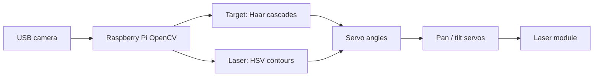

# LaserGuider Pi

A **Raspberry Pi** computer-vision project that **steers a laser** with **two servo motors** so the beam lines up on a chosen target (for example a face or upper body). The Pi watches the scene with a camera, finds the target, looks for the **bright laser spot** in color (green / white in HSV), and **closes the loop** by nudging pan and tilt until the spot sits on the target center.

---

## How it works

1. **Capture** — Each frame comes from a USB camera (`cv2.VideoCapture`) at 640×480 (main guidance script).
2. **Find the target** — OpenCV **Haar cascades** detect objects in the frame (frontal face, profile face, or upper body, depending on mode). The first detection gives a bounding box; the **center of that box** is the aim point.
3. **Find the laser dot** — Inside an expanded region around the target (padding so the spot can be slightly off-center), the code converts to **HSV**, thresholds for **green** and **high-brightness white**, finds contours, and scores them by **circularity** and intensity. That yields the **laser spot position** in image coordinates when visible.
4. **Drive the servos** — **`gpiozero.Servo`** talks to the servos through the **`pigpio` daemon** (`PiGPIOFactory`), which gives stable hardware-timed pulses.
   - **Pan** is on **GPIO 13**, **tilt** on **GPIO 18** (main script).
   - Servo values are in the **−1 … 1** range (`gpiozero`), mapped from angles with **−90° … +90°** as the conceptual span (`angle / 90`).
5. **Control logic**
   - If there is a **target but no reliable laser dot yet**, the rig can **center the view on the target** using assumed **field of view** (defaults: **90° horizontal**, **68° vertical**) to convert pixel offset to angle, then command the servos.
   - If **both target and dot** are seen, the code **nudges** pan/tilt so the dot moves toward the target center, with angle limits (e.g. ±45° horizontal, ±22.5° vertical in the main loop) to avoid runaway.
   - If the dot is **not** acquired, a **raster-style scan** sweeps pan/tilt to search the space.
6. **“Locked”** — When the distance between target center and dot (in pixels) falls below a small threshold, the UI shows **laser locked on target**.



---

## Hardware you need

| Item | Role |
|------|------|
| Raspberry Pi | Runs Python, OpenCV, GPIO |
| USB webcam | Scene image for tracking |
| 2× servo + pan/tilt bracket | Aim the laser in X and Y |
| Laser module | Mounted with the servos; must be **used safely and legally** |
| Wiring | Signal pins **GPIO 13** (X) and **GPIO 18** (Y) as in the main script; power servos appropriately (often external 5 V + common ground, not from Pi 3.3 V logic alone) |

Exact wiring depends on your driver (HAT, level shifter, or servo driver board). The code assumes **`pigpio`** is available for precise servo timing.

---

## Software prerequisites (on the Pi)

- **Python 3** with **OpenCV** (`cv2`), **NumPy**
- **`gpiozero`** with **`pigpio`** pin factory
- **`RPi.GPIO`** (used for cleanup in the main script)
- **`pigpio` daemon** running before launch:  
  `sudo pigpiod`

Optional: **`picamera2`** if you move from USB camera to a Pi camera module (see `Picamera2testedforlaser.py` for a minimal capture test).

---

## Repository layout

| File | Purpose |
|------|---------|
| **`Laser Guidance May 6 complex green dot 8pm 2.py`** | **Main on-device loop**: servos on GPIO 13/18, target detection, green/white dot in ROI, scan + lock behavior. |
| `Green dot code.py` | Earlier / desktop-oriented variant; servo calls mostly commented for testing vision only. |
| `Picamera2testedforlaser.py` | Small **Picamera2** + OpenCV display test. |
| `find the cat.py`, `segmentation of face.py`, `test camera.py`, `search for camera.py` | Experiments and camera bring-up. |
| `Pi on mac.py` | **gpiozero MockFactory** — handy for logic checks **without** real GPIO. |

Run the main guidance script on the Pi (from this folder), with display attached or X forwarding if you use `cv2.imshow`:

```bash
sudo pigpiod
python3 "Laser Guidance May 6 complex green dot 8pm 2.py"
```

### Keyboard shortcuts (main script)

- **`q`** — Quit (stops servos, releases camera, cleans up GPIO)
- **`f`** — Track **face**
- **`b`** — Track **upper body**
- Other keys in the file switch modes (`c`, `t`, etc.) as labeled in the source

Tune **HSV ranges**, **FOV**, **scan speed**, and **pixel thresholds** in the main script if your camera, laser color, or room lighting differ.

---

## Safety and responsibility

Lasers can damage eyes and distract drivers or aircraft. Use **low power**, **eye-safe** classes where appropriate, block the beam from leaving a controlled area, and follow **local laws and regulations**. This repository is for **engineering and research**; you are responsible for how you deploy it.

---

## Author

Project by **Jonathan M. Rothberg** — GitHub: [@jmrothberg](https://github.com/jmrothberg).
